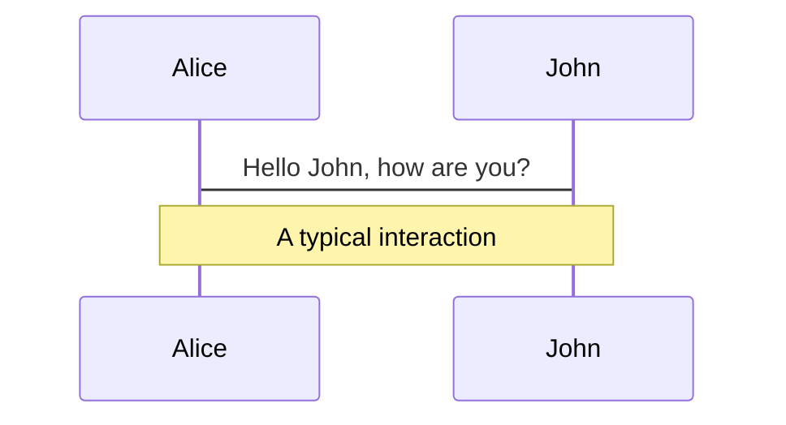
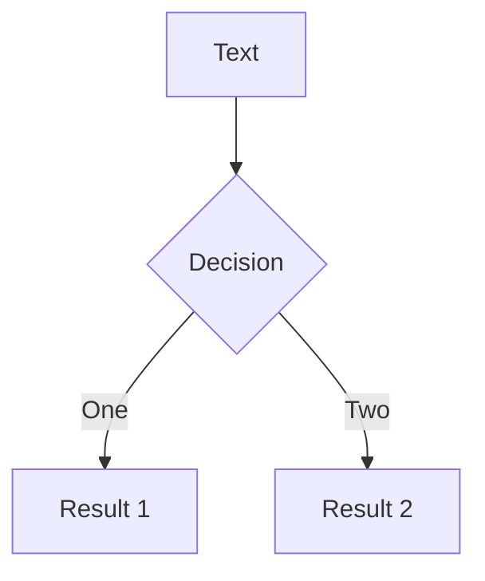
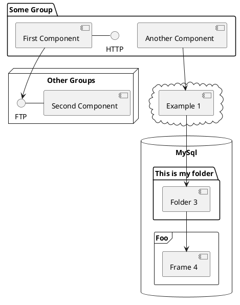

---
# try also 'default' to start simple
theme: dracula
# random image from a curated Unsplash collection by Anthony
# like them? see https://unsplash.com/collections/94734566/slidev
background: https://source.unsplash.com/collection/94734566/1920x1080
# apply any windi css classes to the current slide
class: 'text-center'
# https://sli.dev/custom/highlighters.html
highlighter: shiki
# show line numbers in code blocks
lineNumbers: false
# some information about the slides, markdown enabled
info: |
  ## Slidev Starter Template
  Presentation slides for developers.

  Learn more at [Sli.dev](https://sli.dev)
# persist drawings in exports and build
drawings:
  persist: false
# page transition
transition: slide-left
# use UnoCSS
css: unocss
---

# State of Frontend Frameworks
<div>
  <h5>(at least the 3 major frameworks)</h5>
  <h4>Trevor Arnold: Software Engineer at FTI</h4>
</div>

---

# Origins | Use Cases
<div>
  <h5>Where do they come from and why you would use them?</h5>
</div>

---

# Angular
<div>
  <div grid="~ cols-2 gap-4">
    <div>
      
    </div>
    <div>
      <ul>
        <li>Created and maintained by Google, plus open-source community</li>
        <li>Built on Typescript and you are expected to use it</li>
        <li>"Javascript inserted into your HTML"</li>
        <li>Batteries included option. You need to build it the angular way
          <ul>
            <li>Benefit of standard development and structure --> Easy to find examples that work for your use case</li>
          </ul>
        </li>
        <li>Use-case: larger organizations with larger applications.
          <ul>
            <li>Some state this isn't great for new devs, but I disagree</li>
          </ul>
        </li>
      </ul>
    </div>
  </div>
</div>

---

# React
<div>
  <div grid="~ cols-2 gap-4">
    <div>
      
    </div>
    <div>
      <ul>
        <li>Created and maintained by Facebook (Meta), plus open-source community</li>
        <li>"HTML inserted into your Javascript"</li>
        <li>Not as much out of the box and a lot of flexibility. Means you may also need a lot of other libraries or tools with React
          <ul>
            <li>A lot of tutorials and examples online, however, they can often only work for the context of that example.s</li>
          </ul>
        </li>
        <li>Use-case: smaller applications with smaller teams (<i>meh...</i>)
          <ul>
            <li>Less experienced developers, a ton of documentation</li>
          </ul>
        </li>
      </ul>
    </div>
  </div>
</div>

---

# Vue.js
<div>
  <div grid="~ cols-2 gap-4">
    <div>
      
    </div>
    <div>
      <ul>
        <li>Created and maintained by Evan You (ex-Google), plus open-source community</li>
        <li>Smallest community and similar to angular in that you can structure it how you want
          <ul>
            <li>Difficulties finding examples (compared to Angular and React)</li>
          </ul>
        </li>
        <li>Use-case: want to use something not run by a major tech company and newer. Great for early starters</li>
      </ul>
    </div>
  </div>
</div>

---

# Demo - Project Overview
<div>
  <h2>What I wanted</h2>
  <ul>
    <li>HTTP Request</li>
    <li>Styling</li>
    <li>State Management</li>
    <li>Lifecycle hooks</li>
  </ul>
  <p>Let us take a look.</p>
</div>

---

# Demo - Lessons Learned
<div>
  <ol>
    <li>Understanding that there are two different approaches to developing components in react is important. There would be times I would read an article, just to find out that it was in the wrong approach, ultimately moved to function components.</li>
    <li>Redux was a bit challenging as far as a state management library... This was much easier from Angular experience because we could just create Observables and then subscribe to those observables. This is a bit easier to understand than something like Redux, which is a full blown/master state management library.</li>
    <li>xstate was a bit easier to learn than redux. This could easily been because I did a lot of learning with redux that I was able to carry over to xstate.</li>
    <li>I like the fact that in both vue and react that everything can be easily integrated into a single file. With angular, it seems like you need to be jumping between a lot of different files.</li>
    <li>Angular can be nice because it removes some decision making that can easily get in the way. You can easily run into decision fatigue with the other options. Also means that online resources are a lot nicer to use because they all use the "angular way", vs vue and react have so many different ways that you can solve the same problem.</li>
  </ol>
</div>

---

# Fun Experiment
<div>
  <h2>Chat GPT</h2>
  <p>See what happens when I ask chatgpt for my presentation, just for fun</p>
</div>

---

# Conclussion
<div>
  <ol>
    <li>Easier than I thought to move from one to the other. A lot of the same principles across them all</li>
    <li>State management was definitely the most difficult part across the board</li>
    <li>I like different things about each of them</li>
  </ol>
</div>

---

# Welcome to Slidev

Presentation slides for developers

<div class="pt-12">
  <span @click="$slidev.nav.next" class="px-2 py-1 rounded cursor-pointer" hover="bg-white bg-opacity-10">
    Press Space for next page <carbon:arrow-right class="inline"/>
  </span>
</div>

<div class="abs-br m-6 flex gap-2">
  <button @click="$slidev.nav.openInEditor()" title="Open in Editor" class="text-xl slidev-icon-btn opacity-50 !border-none !hover:text-white">
    <carbon:edit />
  </button>
  <a href="https://github.com/slidevjs/slidev" target="_blank" alt="GitHub"
    class="text-xl slidev-icon-btn opacity-50 !border-none !hover:text-white">
    <carbon-logo-github />
  </a>
</div>

<!--
The last comment block of each slide will be treated as slide notes. It will be visible and editable in Presenter Mode along with the slide. [Read more in the docs](https://sli.dev/guide/syntax.html#notes)
-->

---
transition: fade-out
---

# What is Slidev?

Slidev is a slides maker and presenter designed for developers, consist of the following features

- 📝 **Text-based** - focus on the content with Markdown, and then style them later
- 🎨 **Themable** - theme can be shared and used with npm packages
- 🧑‍💻 **Developer Friendly** - code highlighting, live coding with autocompletion
- 🤹 **Interactive** - embedding Vue components to enhance your expressions
- 🎥 **Recording** - built-in recording and camera view
- 📤 **Portable** - export into PDF, PNGs, or even a hostable SPA
- 🛠 **Hackable** - anything possible on a webpage

<br>
<br>

Read more about [Why Slidev?](https://sli.dev/guide/why)

<!--
You can have `style` tag in markdown to override the style for the current page.
Learn more: https://sli.dev/guide/syntax#embedded-styles
-->

<style>
h1 {
  background-color: #2B90B6;
  background-image: linear-gradient(45deg, #4EC5D4 10%, #146b8c 20%);
  background-size: 100%;
  -webkit-background-clip: text;
  -moz-background-clip: text;
  -webkit-text-fill-color: transparent;
  -moz-text-fill-color: transparent;
}
</style>

<!--
Here is another comment.
-->

---
transition: slide-up
---

# Navigation

Hover on the bottom-left corner to see the navigation's controls panel, [learn more](https://sli.dev/guide/navigation.html)

### Keyboard Shortcuts

|     |     |
| --- | --- |
| <kbd>right</kbd> / <kbd>space</kbd>| next animation or slide |
| <kbd>left</kbd>  / <kbd>shift</kbd><kbd>space</kbd> | previous animation or slide |
| <kbd>up</kbd> | previous slide |
| <kbd>down</kbd> | next slide |

<!-- https://sli.dev/guide/animations.html#click-animations -->

<p v-after class="absolute bottom-23 left-45 opacity-30 transform -rotate-10">Here!</p>

---
layout: image-right
image: https://source.unsplash.com/collection/94734566/1920x1080
---

# Code

Use code snippets and get the highlighting directly![^1]

```ts {all|2|1-6|9|all}
interface User {
  id: number
  firstName: string
  lastName: string
  role: string
}

function updateUser(id: number, update: User) {
  const user = getUser(id)
  const newUser = { ...user, ...update }
  saveUser(id, newUser)
}
```

<arrow v-click="3" x1="400" y1="420" x2="230" y2="330" color="#564" width="3" arrowSize="1" />

[^1]: [Learn More](https://sli.dev/guide/syntax.html#line-highlighting)

<style>
.footnotes-sep {
  @apply mt-20 opacity-10;
}
.footnotes {
  @apply text-sm opacity-75;
}
.footnote-backref {
  display: none;
}
</style>

---

# Components

<div grid="~ cols-2 gap-4">
<div>

You can use Vue components directly inside your slides.

We have provided a few built-in components like `<Tweet/>` and `<Youtube/>` that you can use directly. And adding your custom components is also super easy.

```html
<Counter :count="10" />
```

<!-- ./components/Counter.vue -->
<Counter :count="10" m="t-4" />

Check out [the guides](https://sli.dev/builtin/components.html) for more.

</div>
<div>

```html
<Tweet id="1390115482657726468" />
```

<Tweet id="1390115482657726468" scale="0.65" />

</div>
</div>

<!--
Presenter note with **bold**, *italic*, and ~~striked~~ text.

Also, HTML elements are valid:
<div class="flex w-full">
  <span style="flex-grow: 1;">Left content</span>
  <span>Right content</span>
</div>
-->


---
class: px-20
---

# Themes

Slidev comes with powerful theming support. Themes can provide styles, layouts, components, or even configurations for tools. Switching between themes by just **one edit** in your frontmatter:

<div grid="~ cols-2 gap-2" m="-t-2">

```yaml
---
theme: default
---
```

```yaml
---
theme: seriph
---
```


</div>

Read more about [How to use a theme](https://sli.dev/themes/use.html) and
check out the [Awesome Themes Gallery](https://sli.dev/themes/gallery.html).

---
preload: false
---

# Animations

Animations are powered by [@vueuse/motion](https://motion.vueuse.org/).

```html
<div
  v-motion
  :initial="{ x: -80 }"
  :enter="{ x: 0 }">
  Slidev
</div>
```

<div class="w-60 relative mt-6">
  <div class="relative w-40 h-40">
    
    
    
  </div>

  <div
    class="text-5xl absolute top-14 left-40 text-[#2B90B6] -z-1"
    v-motion
    :initial="{ x: -80, opacity: 0}"
    :enter="{ x: 0, opacity: 1, transition: { delay: 2000, duration: 1000 } }">
    Slidev
  </div>
</div>

<!-- vue script setup scripts can be directly used in markdown, and will only affects current page -->
<script setup lang="ts">
const final = {
  x: 0,
  y: 0,
  rotate: 0,
  scale: 1,
  transition: {
    type: 'spring',
    damping: 10,
    stiffness: 20,
    mass: 2
  }
}
</script>

<div
  v-motion
  :initial="{ x:35, y: 40, opacity: 0}"
  :enter="{ y: 0, opacity: 1, transition: { delay: 3500 } }">

[Learn More](https://sli.dev/guide/animations.html#motion)

</div>

---

# LaTeX

LaTeX is supported out-of-box powered by [KaTeX](https://katex.org/).

<br>

Inline $\sqrt{3x-1}+(1+x)^2$

Block
$$
\begin{array}{c}

\nabla \times \vec{\mathbf{B}} -\, \frac1c\, \frac{\partial\vec{\mathbf{E}}}{\partial t} &
= \frac{4\pi}{c}\vec{\mathbf{j}}    \nabla \cdot \vec{\mathbf{E}} & = 4 \pi \rho \\

\nabla \times \vec{\mathbf{E}}\, +\, \frac1c\, \frac{\partial\vec{\mathbf{B}}}{\partial t} & = \vec{\mathbf{0}} \\

\nabla \cdot \vec{\mathbf{B}} & = 0

\end{array}
$$

<br>

[Learn more](https://sli.dev/guide/syntax#latex)

---

# Diagrams

You can create diagrams / graphs from textual descriptions, directly in your Markdown.

<div class="grid grid-cols-3 gap-10 pt-4 -mb-6">







</div>

[Learn More](https://sli.dev/guide/syntax.html#diagrams)

---
src: ./pages/multiple-entries.md
hide: false
---

---
layout: center
class: text-center
---

# Learn More

[Documentations](https://sli.dev) · [GitHub](https://github.com/slidevjs/slidev) · [Showcases](https://sli.dev/showcases.html)
